```mermaid
flowchart LR

A([Raw HR Data]) --> B[Data Cleaning & Preparation]
B --> C[Exploratory Data Analysis]
C --> D[Define KPI & Business Metrics]
D --> E[Dashboard Design]
E --> F[Develop Visualizations]
F --> G[Interactive Filters & Parameters]
G --> H[Data Validation & Testing]
H --> I([HR Analytics Dashboard])
I --> J([Business Insights & Recommendations])
```

# 📊 HR Attrition Intelligence Dashboard — Tableau Analytics Project


📂 **Download Dashboard File (Tableau Workbook via Google Drive):** [Buka Dashboard](https://drive.google.com/file/d/1cvnXotn8kToo_7JJ5LJUTDRNC8lfoeNy/view?usp=sharing)

---

## 📌 Daftar Isi
- [📊 HR Attrition Intelligence Dashboard — Tableau Analytics Project](#-hr-attrition-intelligence-dashboard--tableau-analytics-project)
  - [📌 Daftar Isi](#-daftar-isi)
  - [🏢 Latar Belakang](#-latar-belakang)
  - [🎯 Tujuan Proyek](#-tujuan-proyek)
  - [🛠 Tech Stack](#-tech-stack)
  - [🗂 Dataset](#-dataset)
  - [🔄 Workflow / Metodologi](#-workflow--metodologi)
  - [🖥 Struktur Dashboard](#-struktur-dashboard)
  - [📈 Hasil \& Insight Utama](#-hasil--insight-utama)
  - [✅ Kesimpulan](#-kesimpulan)
  - [💡 Rekomendasi](#-rekomendasi)
  - [📁 Struktur Repository](#-struktur-repository)
  - [🚀 Cara Menjalankan Dashboard](#-cara-menjalankan-dashboard)
    - [Prasyarat](#prasyarat)
    - [Opsi 1 — Download Workbook](#opsi-1--download-workbook)
    - [Opsi 2 — Clone Repository](#opsi-2--clone-repository)
    - [Menggunakan Dataset HR](#menggunakan-dataset-hr)
    - [Cara Menggunakan Dashboard](#cara-menggunakan-dashboard)
    - [Preview Dashboard](#preview-dashboard)
  - [👤 Kontak](#-kontak)

---

## 🏢 Latar Belakang

Tingkat *employee attrition* (keluarnya karyawan, baik resign maupun terminasi) merupakan salah satu tantangan krusial bagi divisi Human Capital/HR di banyak perusahaan. Attrition yang tinggi berdampak langsung pada:

- **Biaya rekrutmen & onboarding** yang berulang
- **Hilangnya produktivitas** akibat kekosongan posisi
- **Turunnya moral tim** akibat rotasi karyawan yang cepat
- **Hilangnya institutional knowledge** dari karyawan berpengalaman

Namun, banyak keputusan HR masih diambil secara reaktif tanpa didukung data yang terstruktur. Proyek ini dibuat untuk menjawab kebutuhan tersebut dengan membangun **dashboard HR Analytics berbasis Tableau** yang mampu memvisualisasikan pola attrition secara komprehensif — mulai dari departemen, kelompok usia, gender, latar belakang pendidikan, hingga tingkat kepuasan kerja (*job satisfaction*) per peran jabatan.

Dashboard ini dirancang agar dapat digunakan oleh tim HR/HC untuk melakukan **monitoring, diagnosis akar masalah, dan pengambilan keputusan strategis** terkait retensi karyawan.

---

## 🎯 Tujuan Proyek

- Memvisualisasikan **tingkat attrition** secara keseluruhan dan per segmen (departemen, kelompok usia, gender, latar belakang pendidikan)
- Mengidentifikasi **job role** dengan sebaran kepuasan kerja terendah yang berpotensi menjadi *early warning* attrition
- Menyediakan **KPI ringkas** (Employee Count, Attrition Count, Attrition Rate, Active Employees, Avg. Age) sebagai *executive summary*
- Membantu tim HR menyusun **strategi retensi yang lebih tepat sasaran** berdasarkan segmen berisiko tinggi

---

## 🛠 Tech Stack

| Kategori                | Tools                                                                              |
| ----------------------- | ---------------------------------------------------------------------------------- |
| Visualisasi & Dashboard | **Tableau Desktop / Tableau Public**                                               |
| Pengolahan Data         | Excel / CSV (data preparation)                                                     |
| Teknik Analisis         | Calculated Field, Parameter (Bin Size), Filter Interaktif, Dashboard Actions       |
| Tipe Chart              | KPI Card, Pie Chart, Bar Chart, Highlight Table, Donut Chart, Bar-in-Bin Histogram |
| Version Control         | Git & GitHub                                                                       |

---

## 🗂 Dataset

Dataset berisi data historis karyawan dengan atribut utama sebagai berikut:

- Employee ID, Department, Job Role
- Age, Gender, Education Field
- Attrition Status (Yes/No)
- Job Satisfaction Score (skala 1–4)

Total data yang dianalisis: **1.470 karyawan**, dengan **237 kasus attrition (16,12%)**.

📄 Dataset mentah tersedia pada file **`HR Data.xlsx`** di repository ini.

---

## 🔄 Workflow / Metodologi

1. **Data Preparation** — Membersihkan dan menstrukturkan data mentah karyawan (handling missing value, standarisasi kategori, validasi tipe data).
2. **Exploratory Data Analysis (EDA)** — Menelusuri pola awal attrition berdasarkan departemen, usia, dan gender.
3. **Dashboard Design** — Merancang layout dashboard dengan pendekatan *executive dashboard* (KPI di atas, breakdown detail di bawah).
4. **Building Visualizations** — Membuat masing-masing sheet (KPI, Attrition by Gender, Department Wise Attrition, No. of Employee by Age Group, Job Satisfaction Rating, Education Field Wise Attrition, Attrition Rate by Gender for Different Age Group).
5. **Interactivity** — Menambahkan filter global (Education), parameter Bin Size untuk histogram usia, serta highlight/selection antar chart.
6. **Validation & Insight Extraction** — Memvalidasi angka pada setiap chart agar konsisten dengan KPI utama, lalu menyusun insight bisnis.
7. **Publishing & Documentation** — Finalisasi tampilan dashboard dan dokumentasi proyek (README ini).

---



---

## 🖥 Struktur Dashboard

Dashboard terdiri dari 6 komponen visual utama dalam satu halaman:

| Komponen                                                                                                                | Fungsi                                                                     |
| ----------------------------------------------------------------------------------------------------------------------- | -------------------------------------------------------------------------- |
| **KPI Summary** (Employee Count 1.470, Attrition Count 237, Attrition Rate 16,12%, Active Employees 1.233, Avg. Age 37) | Ringkasan metrik utama secara real-time                                    |
| **Attrition by Gender** (Female 87, Male 150)                                                                           | Menunjukkan distribusi attrition berdasarkan gender                        |
| **Department Wise Attrition** (Pie Chart: HR 12, R&D 133, Sales 92)                                                     | Perbandingan jumlah attrition antar departemen                             |
| **No. of Employee by Age Group** (Histogram dengan Bin Size dinamis, interval 4 tahun)                                  | Sebaran jumlah karyawan berdasarkan kelompok usia                          |
| **Job Satisfaction Rating** (Highlight Table, skala 1–4 per Job Role)                                                   | Sebaran skor kepuasan kerja untuk tiap job role                            |
| **Education Field Wise Attrition** (Bar Chart)                                                                          | Attrition berdasarkan latar belakang pendidikan                            |
| **Attrition Rate by Gender for Different Age Group** (Donut Chart interaktif)                                           | Proporsi attrition per kelompok usia & gender, dengan filter klik langsung |

---

## 📈 Hasil & Insight Utama

1. **Attrition Rate berada di 16,12%** — dari total 1.470 karyawan, 237 di antaranya mengalami attrition, dengan 1.233 karyawan masih aktif. Angka ini berada sedikit di atas rata-rata industri yang umumnya berkisar 10–15%, sehingga tetap perlu perhatian meskipun tidak dalam kategori kritis.

2. **Departemen R&D menyumbang jumlah attrition terbesar** — 133 dari 237 kasus (56,12%) berasal dari R&D, diikuti Sales sebanyak 92 kasus (38,82%), dan HR hanya 12 kasus (5,06%). Karena R&D umumnya juga memiliki headcount terbesar, angka ini perlu dibaca sebagai *jumlah kasus*, bukan otomatis *tingkat attrition tertinggi per departemen*.

3. **Attrition terkonsentrasi pada karyawan usia 25–34 tahun** — kelompok usia ini menyumbang 112 dari 237 kasus attrition (±47,3%), jauh di atas kelompok usia lain: Under 25 (38 kasus), 35–44 (51 kasus), 45–54 (25 kasus), dan Over 55 (11 kasus). Pada kelompok 25–34, attrition pada karyawan **pria (69 kasus)** jauh lebih tinggi dibanding **wanita (43 kasus)**.

4. **Gender: pria mendominasi total attrition** — dari 237 kasus, 150 (63,3%) adalah karyawan pria dan 87 (36,7%) adalah karyawan wanita. Pola ini konsisten di hampir semua kelompok usia, dengan gap terbesar terjadi pada kelompok usia 25–34 dan 35–44 tahun.

5. **Latar belakang pendidikan Life Sciences paling banyak terdampak** — 89 dari 237 kasus attrition (37,6%) berasal dari bidang Life Sciences, diikuti Medical (63 kasus / 26,6%), Marketing (35), Technical Degree (32), Other (11), dan Human Resources (7).

6. **Job Satisfaction bervariasi antar job role** — *Sales Executive* memiliki jumlah karyawan dengan skor kepuasan terendah (level 1) paling banyak, yaitu 69 dari 326 karyawan (±21,2%), diikuti *Laboratory Technician* dengan 56 dari 259 karyawan (±21,6%) di level 1. Sebaliknya, role seperti *Research Scientist* dan *Healthcare Representative* menunjukkan proporsi karyawan dengan skor kepuasan tinggi (level 3–4) yang lebih dominan, mengindikasikan pengalaman kerja yang secara umum lebih positif pada role tersebut.

---

## ✅ Kesimpulan

Dashboard ini berhasil mengubah data HR mentah menjadi **narasi bisnis yang jelas dan actionable**. Dengan attrition rate 16,12% dari total 1.470 karyawan, temuan utama menunjukkan bahwa attrition **tidak terjadi secara acak**, melainkan terkonsentrasi pada segmen tertentu: departemen R&D dan Sales, karyawan usia 25–34 tahun, karyawan pria, serta karyawan dengan latar belakang pendidikan Life Sciences/Medical. Job role seperti *Sales Executive* dan *Laboratory Technician* juga menunjukkan proporsi kepuasan kerja rendah yang relatif lebih tinggi dibanding role lain. Temuan ini mengindikasikan perlunya intervensi HR yang lebih terarah pada segmen berisiko, bukan pendekatan retensi yang bersifat umum/generik.

---

## 💡 Rekomendasi

1. **Fokus intervensi retensi pada departemen R&D dan Sales**, misalnya melalui evaluasi beban kerja, struktur insentif, jenjang karier, dan lingkungan kerja tim.
2. **Rancang program engagement khusus untuk karyawan usia 25–34 tahun**, seperti mentoring, career pathing, atau fleksibilitas kerja, karena kelompok ini paling rentan resign — terutama pada karyawan pria di rentang usia tersebut.
3. **Lakukan *stay interview*/survei kepuasan lanjutan** khususnya pada role *Sales Executive* dan *Laboratory Technician* untuk menggali akar masalah spesifik di balik rendahnya skor kepuasan kerja.
4. **Evaluasi proses rekrutmen untuk kandidat dari bidang Life Sciences/Medical**, guna memastikan kesesuaian ekspektasi peran sejak tahap seleksi (person-job fit).
5. **Telusuri lebih lanjut disparitas attrition berdasarkan gender**, khususnya proporsi attrition pria yang lebih tinggi (63,3%), untuk memastikan tidak ada isu struktural terkait beban kerja atau lingkungan kerja tertentu.
6. **Bangun sistem monitoring attrition berkelanjutan** (dashboard live/berkala) agar tim HR dapat mendeteksi tren attrition secara dini, bukan hanya evaluasi retrospektif.
7. **Kombinasikan analisis ini dengan data kualitatif** (exit interview, survei engagement) agar rekomendasi lebih holistik dan tidak hanya berbasis angka.

---

## 📁 Struktur Repository

```
hr-attrition-analytics-dashboard/
│
├── HR Data.xlsx                          # Dataset mentah karyawan (sumber data)
├── Overview HR Analytis Dashboard.png    # Screenshot preview dashboard
└── README.md                             # Dokumentasi proyek
```

> 💡 File workbook Tableau (`.twbx`) dapat diakses melalui link Google Drive pada bagian atas README ini, karena ukurannya melebihi batas nyaman untuk disimpan langsung di GitHub.

---

## 🚀 Cara Menjalankan Dashboard

### Prasyarat

Pastikan Anda telah menginstal salah satu aplikasi berikut:

- Tableau Desktop
- Tableau Reader

---

### Opsi 1 — Download Workbook

1. Unduh file **Overview HR Attrition Dashboard.twbx** melalui Google Drive:

   > https://drive.google.com/file/d/1cvnXotn8kToo_7JJ5LJUTDRNC8lfoeNy/view?usp=sharing

2. Buka file tersebut menggunakan **Tableau Desktop** atau **Tableau Reader**.

---

### Opsi 2 — Clone Repository

Clone repository ini ke komputer Anda:

```bash
git clone https://github.com/alfitranurr/hr-attrition-analytics-dashboard.git
```

Kemudian buka file **Overview HR Attrition Dashboard.twbx** menggunakan **Tableau Desktop** atau **Tableau Reader**.

---

### Menggunakan Dataset HR

Repository ini telah menyediakan dataset **HR Data.xlsx** yang digunakan sebagai sumber data dashboard.

- Saat membuka file **Overview HR Attrition Dashboard.twbx**, Tableau akan secara otomatis menggunakan dataset tersebut apabila berada pada lokasi yang sama dengan workbook.
- Jika Tableau meminta untuk memperbarui lokasi data (*Locate Data Source*), arahkan ke file **HR Data.xlsx** yang tersedia di dalam repository.

---

### Cara Menggunakan Dashboard

- Gunakan filter **Education** di pojok kanan atas untuk memfilter data.
- Klik pada visualisasi seperti **Age Group**, **Department**, atau **Job Role** untuk melakukan eksplorasi interaktif (*cross-filtering*).
- Gunakan parameter **Bin Size** pada histogram usia untuk mengubah lebar interval kelompok umur.
- Arahkan kursor ke setiap chart untuk melihat informasi detail (*tooltip*).

---

### Preview Dashboard

Apabila Anda belum memiliki Tableau Desktop atau Tableau Reader, Anda tetap dapat melihat tampilan dashboard melalui file **Overview HR Analytis Dashboard.png** yang tersedia pada repository ini.

---

## 👤 Kontak

<table>
<tr>
<td width="90">

</td>
<td>

**Al Fitra Nur R.**
Informatics Graduate — Universitas Muhammadiyah Malang *(Cumlaude, Best Graduate)*
Fokus: Data Analytics · Business Intelligence · AI Automation

🌐 Portfolio : [alfitranurr.vercel.app](https://alfitranurr.vercel.app)
💻 GitHub&nbsp;&nbsp;&nbsp;: [github.com/alfitranurr](https://github.com/alfitranurr)
📂 Dashboard : [Lihat via Google Drive](https://drive.google.com/file/d/1cvnXotn8kToo_7JJ5LJUTDRNC8lfoeNy/view?usp=sharing)

</td>
</tr>
</table>

---
<sub>© 2026 Al Fitra Nur R. — Dibuat untuk portofolio Data Analyst / HR Analytics.</sub>